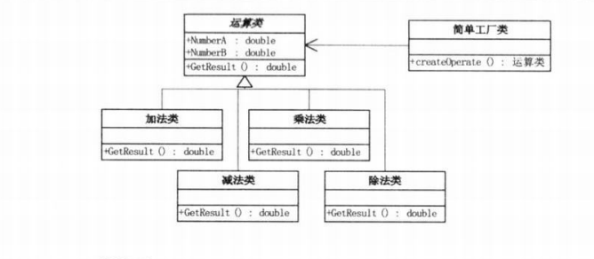

## 1.1 面试受挫
~

## 1.2 初学者代码毛病
* 命名非常不规范
* 判断分支 用if需要判断多次，浪费资源
* 如果除数输入了0 怎么办，如果用户输入的是字符符号而不是数字怎么办

## 1.3 代码规范
~

```
import java.util.Scanner;

public class program {
	public static void main(String[] args) {
		try {
			Scanner sc = new Scanner(System.in);
			System.out.println("请输入数字A: ");
			String strNumberA = sc.next();
			System.out.println("请输入运算符号(+、-、*、/): ");
			String strOperate = sc.next();
			System.out.println("请输入数字B: ");
			String strNumberB = sc.next();
			String strResult = "";
			switch (strOperate) {
			case "+":
				strResult = String.valueOf((Double.parseDouble(strNumberA) + Double.parseDouble(strNumberB)));
				break;
			case "-":
				strResult = String.valueOf((Double.parseDouble(strNumberA) - Double.parseDouble(strNumberB)));
				break;
			case "*":
				strResult = String.valueOf((Double.parseDouble(strNumberA) * Double.parseDouble(strNumberB)));
				break;
			case "/":
				if (strNumberB.equals("0")) {
					System.out.println("除数不能为0");
					return;
				} else
					strResult = String.valueOf((Double.parseDouble(strNumberA) / Double.parseDouble(strNumberB)));
				break;
			}
			if (strResult == "")
				throw new Exception();
			System.out.println("结果是" + strResult);
		} catch (Exception ex) {
			System.out.println("输入有误:" + ex);
		}
	}
}
```

## 1.4面向对象编程
~

## 1.5 活字印刷，面向对象
* 可复用
* 可扩展

## 1.6 面向对象的好处
* 通过封装、继承、多态把程序的耦合度降低
* 用设计模式使得程序更加灵活，容易修改，并且易于复用


## 1.7 复制vs. 复用
~

## 1.8 业务封装
```
import java.util.Scanner;

class Operation {
	public static double getResult(String strNumberA, String strOperate, String strNumberB) {
		String strResult = "";
		switch (strOperate) {
		case "+":
			strResult = String.valueOf((Double.parseDouble(strNumberA) + Double.parseDouble(strNumberB)));
			break;
		case "-":
			strResult = String.valueOf((Double.parseDouble(strNumberA) - Double.parseDouble(strNumberB)));
			break;
		case "*":
			strResult = String.valueOf((Double.parseDouble(strNumberA) * Double.parseDouble(strNumberB)));
			break;
		case "/":
			strResult = String.valueOf((Double.parseDouble(strNumberA) / Double.parseDouble(strNumberB)));
			break;
		}
		return Double.parseDouble(strResult);
	}
}
public class client {
	public static void main(String[] args) {
		new client().clientScanner();
	}
	public void clientScanner() {
		try {
			Scanner sc = new Scanner(System.in);
			System.out.println("请输入数字A: ");
			String strNumberA = sc.next();
			System.out.println("请输入运算符号(+、-、*、/): ");
			String strOperate = sc.next();
			System.out.println("请输入数字B: ");
			String strNumberB = sc.next();
			if (strNumberB.equals("0")) {
				System.out.println("除数不能为0");
			} 
			String strResult = String.valueOf(Operate.getResult(strNumberA, strOperate, strNumberB));
			if (strResult == "")
				throw new Exception();
			System.out.println("结果为: "+ strResult);
		} catch (Exception ex) {
			System.out.println("输入有误:" + ex);
		}
	}
}
```

## 1.9 紧耦合 vs. 松耦合
* 增加某功能，却需要对其他的方法进行编译，或者不小心会改掉别人的代码，很可能导致原有的代码发生改变，使用继承和多态解决

## 1.10 简单工厂模式
~

```
import java.util.Scanner;

abstract class  Operation {
	private Double _numberA;
	private Double _numberB;
	public Double get_numberA() {
		return _numberA;
	}

	public void set_numberA(Double _numberA) {
		this._numberA = _numberA;
	}

	public Double get_numberB() {
		return _numberB;
	}

	public void set_numberB(Double _numberB) {
		this._numberB = _numberB;
	}

	public abstract Double getResult() throws Exception ;

}

class OperationAdd extends Operation {
	public Double getResult() {
		double result = 0d;
		result = get_numberA()+get_numberB();
		return result;
	}
}

class OperationSub extends Operation {
	public Double getResult() {
		double result = 0d;
		result = get_numberA() - get_numberB();
		return result;
	}
}

class OperationMul extends Operation {
	public Double getResult() {
		double result = 0d;
		result = get_numberA() * get_numberB();
		return result;
	}
}

class OperationDiv extends Operation {
	public Double getResult() throws Exception {
		if(get_numberB() == 0d) {
			throw new Exception("除数不能为0");
		}
		else { 
			double result = 0d;
			result = get_numberA() / get_numberB();
			return result;
		}
	}
}

class OperationFactory{
	static Operation oper = null;
	public static Operation createOperate(String operate) {
		switch (operate) {
		case "+":
			oper = new OperationAdd();
			break;
		case "-":
			oper = new OperationSub();
			break;
		case "*":
			oper = new OperationMul();
			break;
		case "/":
			oper = new OperationDiv();
			break;
		default:
			break;
		}
		return oper;
	}
}


public class client {
	public static void main(String[] args) {
		new client().clientScanner();
	}
	public void clientScanner() {
		try {
			Scanner sc = new Scanner(System.in);
			System.out.println("请输入数字A: ");
			String strNumberA = sc.next();
			System.out.println("请输入运算符号(+、-、*、/): ");
			String strOperation = sc.next();
			System.out.println("请输入数字B: ");
			String strNumberB = sc.next();
			Operation oper = OperationFactory.createOperate(strOperation);
			oper.set_numberA(Double.parseDouble(strNumberA));
			oper.set_numberB(Double.parseDouble(strNumberB));
			String strResult = String.valueOf(oper.getResult());
			if (strResult.equals(""))
				throw new Exception();
			else 
				System.out.println("结果为: "+ strResult);
		} catch (Exception ex) {
			System.out.println("输入有误:" + ex);
		}
	}
}
```

